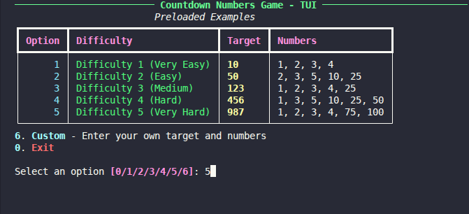
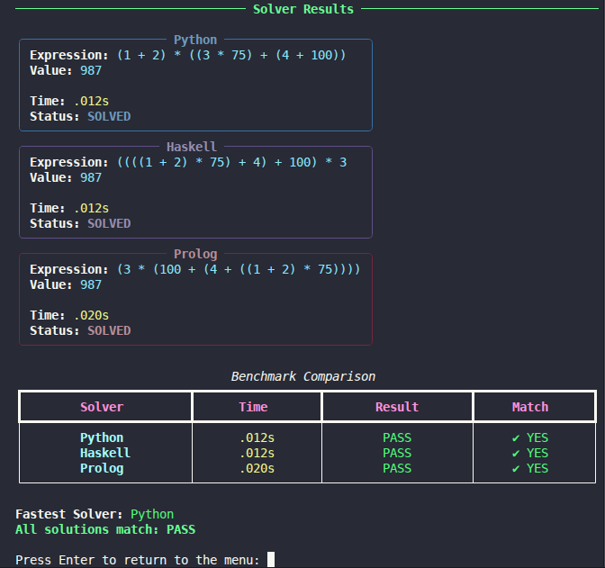

# NumberCruncher: Multi-Language Countdown Solver

## Overview
NumberCruncher is a comparative logic suite designed to solve the numeric portion of the Countdown game. It features three independent solvers written in **Python**, **Haskell**, and **Prolog**, orchestrated by a unified Text User Interface (TUI) for benchmarking and result comparison.


## Prerequisites & Installation

### Core Dependencies
To run the full suite, one must install the compilers and interpreters for all three languages.

| Platform | Command |
|----------|---------|
| **Debian / Ubuntu / Kali** | `sudo apt update && sudo apt install python3 ghc swi-prolog` |
| **Arch Linux** | `sudo pacman -Syu python ghc swi-prolog` |
| **macOS (Homebrew)** | `brew install python ghc swi-prolog` |

### Python Dependencies
The TUI requires the `rich` library. Install it using the provided requirements file:
```bash
pip install -r requirements.txt
```
#### If on Debian based systems 
```bash
sudo apt install python3-rich # much simpler
```

## Running the Project
The primary entry point is the interactive TUI.
```bash
python3 src/tui_wraper/tui.py
```

### Quick Execution (Installable Command)
```bash
pip install -e .
crunch
```
This will launch a menu to select difficulty levels or enter custom target numbers and values.
---



---

## Running the Tests
To run the full suite of unit and integration tests:
```bash
python3 -m unittest discover -s tests -v
```


## Individual Execution (Examples)

**Target:** `765` | **Numbers:** `1 3 7 10 25 50`

### 1. Python
```bash
python3 src/python/countdown.py 765 1 3 7 10 25 50
```

### 2. Haskell
```bash
cd src/haskell
ghc -O2 -o countdown countdown.hs
./countdown 765 1 3 7 10 25 50
```

### 3. Prolog
```bash
swipl -s src/prolog/countdown.pl -g "main(765, [1, 3, 7, 10, 25, 50]), halt."
```

---
## Documentation Index
Detailed technical references for every component are available in the repository:
- [Source Code Overview](src/README.md)
- [Automated Tests Overview](tests/README.md)
- [Python Solver Reference](docs/src_docs/countdown_py_doc.md)
- [Haskell Solver Reference](docs/src_docs/countdown_hs_doc.md)
- [Prolog Solver Reference](docs/src_docs/countdown_pl_doc.md)
- [TUI & Execution Orchestration Reference](docs/src_docs/tui_py_doc.md)
- [Python Solver Test Reference](docs/tests_docs/test_python_solver_doc.md)
- [Haskell Solver Test Reference](docs/tests_docs/test_haskell_solver_doc.md)
- [Prolog Solver Test Reference](docs/tests_docs/test_prolog_solver_doc.md)
- [Orchestration Test Reference](docs/tests_docs/test_orchestration_doc.md)

## Project Structure
- `src/python/`: Recursive search implementation in Python.
- `src/haskell/`: Expression tree search using Haskell.
- `src/prolog/`: Backtracking-based search in SWI-Prolog.
- `src/tui_wraper/`: Consolidation layer including `run_all.sh` and the TUI.
